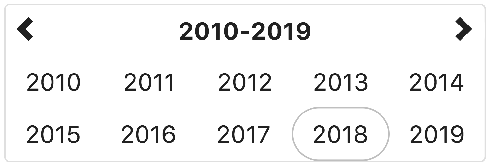
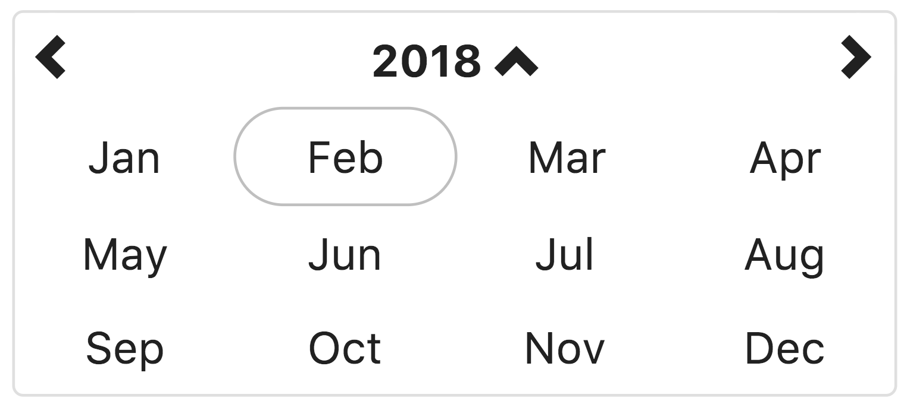
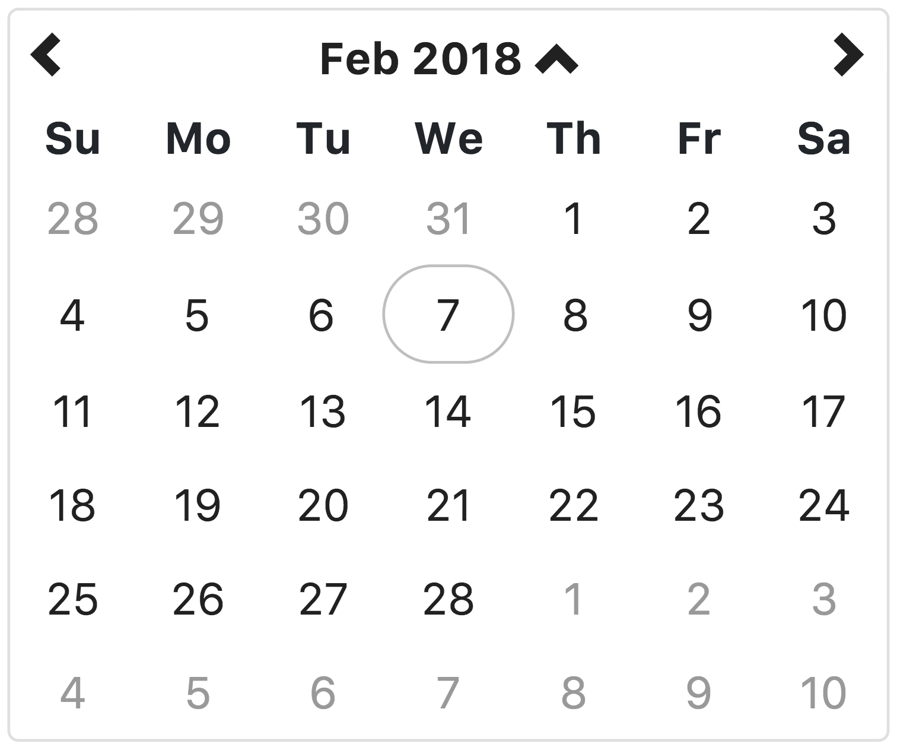
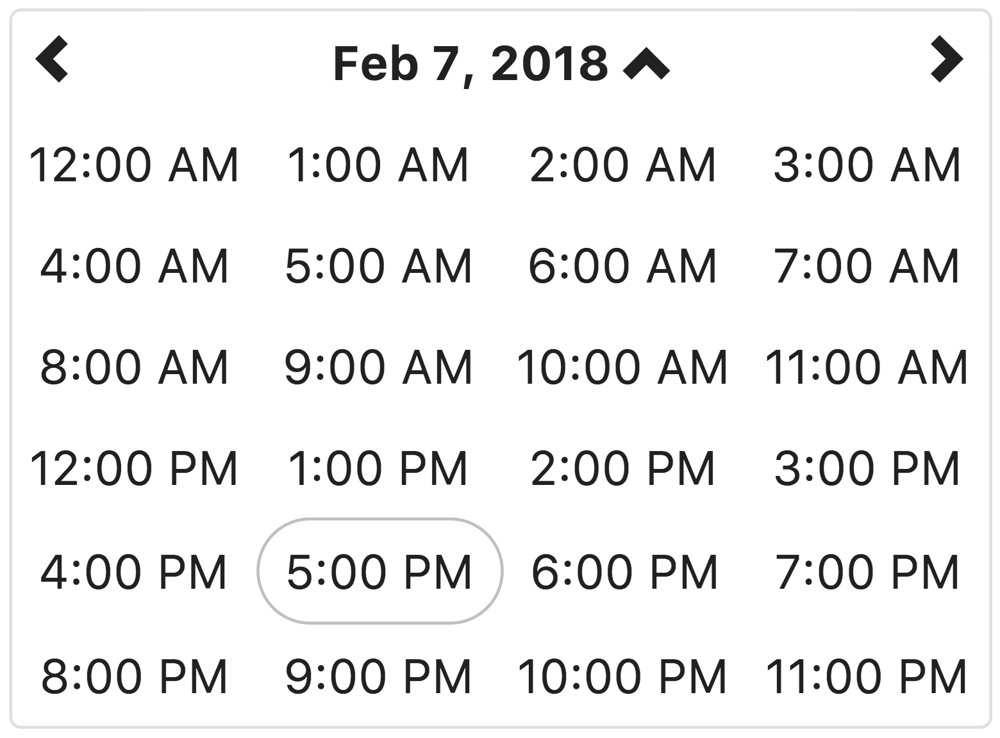
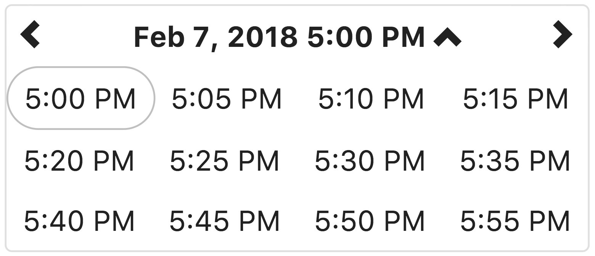

# Angular 4+ bootstrap date & time picker

Native Angular (4+) datetime picker directive styled by Twitter Bootstrap

[](https://gitter.im/dalelotts/angular-bootstrap-datetimepicker?utm_source=badge&utm_medium=badge&utm_campaign=pr-badge&utm_content=badge)
[![MIT License][license-image]][license-url]
[](https://travis-ci.org/dalelotts/angular-bootstrap-datetimepicker)
[](https://coveralls.io/github/dalelotts/angular-bootstrap-datetimepicker?branch=master)
[](https://david-dm.org/dalelotts/angular-bootstrap-datetimepicker)
[](https://david-dm.org/dalelotts/angular-bootstrap-datetimepicker#info=devDependencies)
[](https://github.com/semantic-release/semantic-release)
[](http://standardjs.com/)
[](http://commitizen.github.io/cz-cli/)
[](https://snyk.io/test/npm/angular-bootstrap-datetimepicker)
[](https://www.paypal.com/cgi-bin/webscr?cmd=_donations&business=F3FX5W6S2U4BW&lc=US&item_name=Dale%20Lotts&item_number=angular%2dbootstrap%2ddatetimepicker&currency_code=USD&bn=PP%2dDonationsBF%3abtn_donate_SM%2egif%3aNonHosted "Donate one-time to this project using Paypal")
<a href="https://twitter.com/intent/tweet?original_referer=https%3A%2F%2Fabout.twitter.com%2Fresources%2Fbuttons&amp;text=Check%20out%20this%20%23AngularJS%20directive%20that%20makes%20it%20dead%20simple%20for%20users%20to%20select%20dates%20%26%20times&amp;tw_p=tweetbutton&amp;url=https%3A%2F%2Fgithub.com%2Fdalelotts%2Fangular-bootstrap-datetimepicker&amp;via=dalelotts" target="_blank">
  </img>
</a>

[Home / demo page](http://dalelotts.github.io/angular-bootstrap-datetimepicker/)

## Support the project
I know this is a tiny directive but many people use it in production (high 5 to all of us) - if you happen to use this directive please click the star button (at the top of the page) - it means a lot to all the contributors.

## Usage with Angular CLI
We use npm for dependency management, run

```shell
npm install --save angular-bootstrap-datetimepicker
```

This will copy the angular-bootstrap-datetimepicker files into your `node_modules` folder, along with its dependencies.

## Configuration

Use the automated configuration generator (please let me know if it does not work for your use case!), or read the documentation below.

### First day of week

The first day of the week is also determined by moment's locale settings. For example, setting the locale to ```'fr'```
will cause Monday to be the first day of the week.  

### Display of year, month, day, hour, am/pm, and minute formats

The format of hours and minutes is also determined by [moment's i18n settings](https://momentjs.com/docs/#/i18n/).

hours are displayed using 'll' as the format.
minutes are displayed using 'lll' as the format. 

I recommend you use the default locale settings from Moment (if they are incorrect, submit a PR to moment to correct the settings)
If for some reason the default Moment settings will not work, you can [customize the existing locale](https://momentjs.com/docs/#/customization/) or [create a custom locale](https://momentjs.com/docs/#/i18n/adding-locale/) with the desired formats.

### Overriding html template

### Formatting the date in an input box

### Inputs

#### maxView

#### minView

#### startView

#### leftIconClass

#### upIconClass

#### rightIconClass

### Outputs

#### change

## Internationalization (i18n) and Localization (l10n)

## Using with a screen reader

## Examples

### Date picker only

### Time picker only

### Inline date/time picker

### Inline date/time picker with data bound to the page with the format specified via date filter

### As a drop-down date/time picker

#### Bootstrap 4 dropdown

### Drop-down date/time picker with associated input box

### Minimum date/time

### Restrict past dates from being selected

### Create a date range picker with validation controls

### Fixed time zone
By default, all dates and times are in the users local time zone. If you want all dates and times
to be in a specific fixed time zone (regardless of users time zone) you can ... `???`

### UTC Mode

### Touch mode (for use on mobile devices)

## Screen shots

## Year view



This view allows the user to select the year for the target date.
If the year view is the minView, the date will be set to midnight on the first day of the year

## Month view



This view allows the user to select the month in the selected year.
If the month view is the minView, the date will be set to midnight on the first day of the month.

## Day view (Default)



This view allows the user to select the the day of the month, in the selected month.
If the day view is the minView, the date will be set to midnight on the day selected.

## Hour view



This view allows the user to select the hour of the day, on the selected day.
If the hour view is the minView, the date will be set to the beginning of the hour on the day selected.

## Minute view



This view allows the user to select a specific time of day, in the selected hour.
By default, the time is displayed in 5 minute increments. The <code>minuteStep</code> property controls the increments of time displayed.
If the minute view is the minView, which is is by default, the date will be set to the beginning of the hour on the day selected.

## Dependencies

Required peer dependencies:
 * AngularJS 4.x or higher (1.x will not work)
 * moment.js 2.8.3 or higher for date parsing and formatting
 
optional:

## Contributing

See [Contributing.md](.github/contributing.md)

### Testing
This directive was written using TDD and all enhancements and changes have related tests.

We use karma and jshint to ensure the quality of the code. The easiest way to run these checks is to use gulp:

```shell
npm install
npm test
```

The karma task will try to open Chrome as a browser in which to run the tests.
Make sure Chrome is available or change the browsers setting in karma.config.js

## License

angular-bootstrap-datetimepicker is released under the MIT license and is copyright 2015 Knight Rider Consulting, Inc.. Boiled down to smaller chunks, it can be described with the following conditions.

## It requires you to:

* Keep the license and copyright notice included in angular-bootstrap-datetimepicker's CSS and JavaScript files when you use them in your works

## It permits you to:

* Freely download and use angular-bootstrap-datetimepicker, in whole or in part, for personal, private, company internal, or commercial purposes
* Use angular-bootstrap-datetimepicker in packages or distributions that you create
* Modify the source code
* Grant a sublicense to modify and distribute angular-bootstrap-datetimepicker to third parties not included in the license

## It forbids you to:

* Hold the authors and license owners liable for damages as angular-bootstrap-datetimepicker is provided without warranty
* Hold the creators or copyright holders of angular-bootstrap-datetimepicker liable
* Redistribute any piece of angular-bootstrap-datetimepicker without proper attribution
* Use any marks owned by Knight Rider Consulting, Inc. in any way that might state or imply that Knight Rider Consulting, Inc. endorses your distribution
* Use any marks owned by Knight Rider Consulting, Inc. in any way that might state or imply that you created the Knight Rider Consulting, Inc. software in question

## It does not require you to:

* Include the source of angular-bootstrap-datetimepicker itself, or of any modifications you may have made to it, in any redistribution you may assemble that includes it
* Submit changes that you make to angular-bootstrap-datetimepicker back to the angular-bootstrap-datetimepicker project (though such feedback is encouraged)

The full angular-bootstrap-datetimepicker license is located [in the project repository](LICENSE) for more information.


## Donating
Support this project and other work by Dale Lotts via [gittip][gittip-dalelotts].

[![Support via Gittip][gittip-badge]][gittip-dalelotts]

[gittip-badge]: https://rawgithub.com/twolfson/gittip-badge/master/dist/gittip.png
[gittip-dalelotts]: https://www.gittip.com/dalelotts/

[license-image]: http://img.shields.io/badge/license-MIT-blue.svg?style=flat
[license-url]: LICENSE
